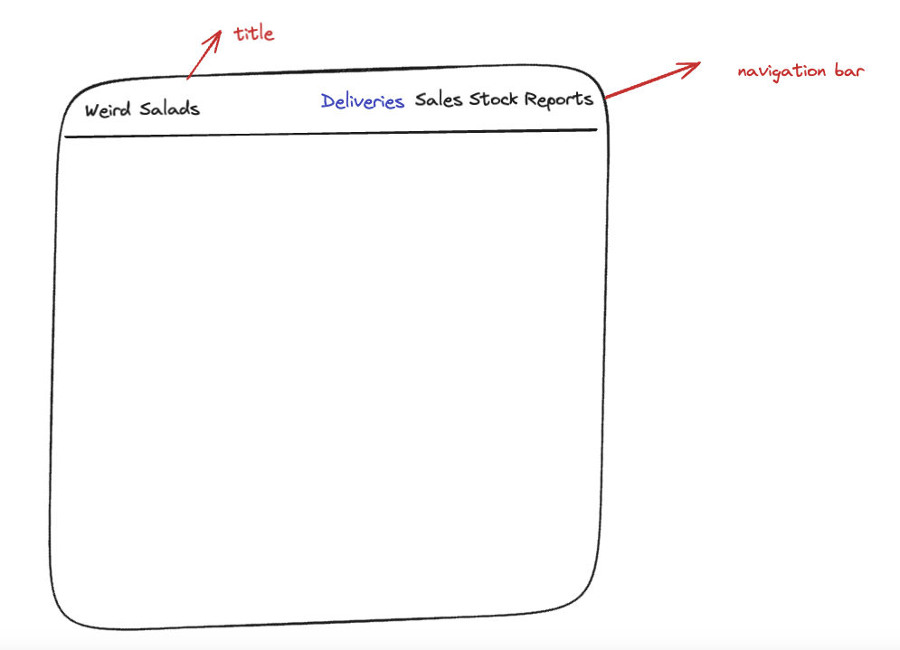
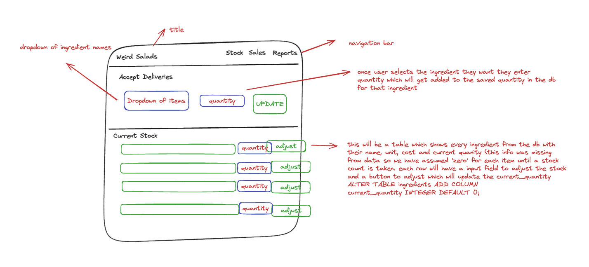

# Nory Inventory Management App

## Overview

This is an inventory management application designed for the fictional restaurant chain "Weird Salads". The application helps manage inventory more efficiently across multiple locations.

### Technology Choices

- **Next.js**: Chosen because it allows both API and UI to be developed in the same place, which is efficient when timelines are tight.
- **JavaScript**: Used for both front-end and back-end due to its versatility and my familiarity with it.
- **SQLite**: A relational database was chosen because the data was relational in nature.
- **Tailwind CSS**: Installed because I can work more quickly with it for styling.
- **Excalidraw**: Used for quick and rough designs due to its ease of use.

## Designs

### Initial Drawing



### Redesigned Home Page



## Time constraints

Due to tight timeline I haven't added a separate control for accepting deliveries - thought process was that
staff could simply do this via the main stock screen and simply add the number of each item to current quantity,
takes a little math for now but longer term I would build out an additional area for this as highlighted in redesign above.

## Getting Started

Follow these steps to set up and run the application:

### Prerequisites

Make sure you have the following software installed on your machine:

- **Node.js**
- **Git**

### Installation

1. **Clone the repo**:

   ```bash
   git clone https://github.com/yourusername/nory_inventory_app.git
   cd nory_inventory_app

   ```

2. **Install dependancies with npm**:

   ```bash
   npm install

   ```

3. **might need to update permissions for db for initial seed**:

   ```bash
   chmod +x seed_database.sh

   ```

4. **run the app**:
   ```bash
   npm run dev
   ```
